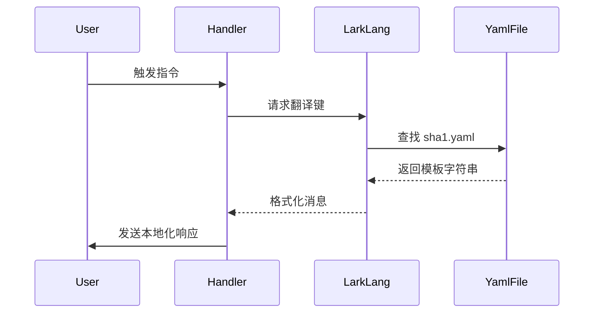

# 插件实现原理剖析

> 本页面使用 DeepSeek-R1 辅助生成。

::: tip 前置知识
建议先阅读 [首个插件开发指南][1] 并理解 SHA1 插件的实现原理
:::

## 项目结构解析

插件部署后典型目录结构如下（精简版）：

```bash {3,5,8} [核心目录标注]
.
├── ...
└── src
    ├── lang
    │   ├── zh_hans
    │   │   ├── sha1.yaml    # 语言文件
    │   └── ...
    ├── plugins
    │   ├── nonebot_plugin_sha1
    │   │   ├── __init__.py  # 插件入口
    │   │   ├── __main__.py  # 核心逻辑
    │   │   └── help.yaml    # 帮助文档
    │   └── ...
    └── templates
        └── ...              # 模板文件
```

### 核心目录说明

| 目录            | 功能说明                                                                 |
|-----------------|--------------------------------------------------------------------------|
| `src/lang/`     | 多语言文件存储，`zh_hans` 为默认中文，`en_us`/`zh_tw` 通过 Crowdin 管理 |
| `src/plugins/`  | 插件主目录，由 `nb-cli` 加载                                            |
| `src/templates/`| Jinja 模板目录，需配合 [Render][3] 插件使用                             |

## 核心代码实现

### 元数据声明 (`__init__.py`)

```python
from nonebot.plugin import PluginMetadata

# highlight-start
# 关键元数据配置
__plugin_meta__ = PluginMetadata(
    name="nonebot-plugin-sha1",  # 插件名称（遵循 nonebot-plugin- 前缀规范）
    description="SHA1 摘要提取",  # 简短功能描述
    usage="",                    # 使用说明（留空时自动生成）
    config=None,                  # 配置类（本插件无需配置）
)
# highlight-end

# 声明插件依赖（必须前置加载）
from nonebot import require
require("nonebot_plugin_larklang")  # 多语言支持
require("nonebot_plugin_larkutils") # 工具函数集

# 导入核心逻辑模块
from . import __main__
```

::: warning 重要实践
将指令注册和业务逻辑分离到 `__main__.py` 是推荐做法，可以：
1. 避免循环导入
2. 提升代码可维护性
3. 方便单元测试
:::

### 指令处理逻辑 (`__main__.py`)

#### 基础框架搭建

```python
# highlight-start
# 标准库导入
import hashlib

# NoneBot 核心组件
from nonebot import on_command
from nonebot.adapters import Message
from nonebot.params import CommandArg

# 插件依赖组件
from nonebot_plugin_larklang import LangHelper
from nonebot_plugin_larkutils import get_user_id
# highlight-end

# 指令声明（响应 "sha1" 命令）
sha1 = on_command("sha1")

# 初始化多语言模块（自动关联 sha1.yaml）
lang = LangHelper()
```

#### 响应器实现

```python
@sha1.handle()
async def handle_sha1(
    message: Message = CommandArg(),       # 注入消息参数
    user_id: str = get_user_id()           # 注入用户ID
) -> None:
    # 提取消息纯文本（过滤非文本内容）
    text = message.extract_plain_text()
    
    # 计算SHA1摘要（UTF-8编码）
    sha1sum = hashlib.sha1(text.encode()).hexdigest()
    
    # 发送本地化响应（格式：sha1.sha1）
    await lang.finish("sha1.sha1", user_id, sha1sum)
```

::: danger 安全规范
必须通过 `get_user_id()` 获取用户标识：
1. 适配不同平台ID体系
:::

## 关键技术解析

### 依赖注入

| 方法                | 返回类型 | 说明                          |
|--------------------|----------|-----------------------------|
| `CommandArg()`     | Message  | 原始消息对象（含图片/表情等）     |
| `get_user_id()`    | str      | 跨平台标准化用户ID              |

### 多语言系统工作流



## 最佳实践指南

1. **消息处理规范**
   - 使用 `extract_plain_text()` 过滤非文本内容
   - 复杂消息解析推荐使用 [Alconna][8]

2. **多语言开发**
   - 键名遵循 `插件域.功能.子项` 三级结构
   - 中文翻译存于 `zh_hans/插件名.yaml`
   - 通过 Crowdin 贡献其他语言

3. **依赖管理**
   ```python
   # 正确声明方式
   require("nonebot_plugin_larklang")
   
   # 错误方式（导致加载顺序问题）
   import nonebot_plugin_larklang
   ```

## 后续学习路径

▶ [插件帮助文档编写指南][9]

[1]: first-plugin
[2]: /plugins/lang
[3]: /plugins/render
[4]: https://nonebot.dev/docs/advanced/plugin-info#%E6%8F%92%E4%BB%B6%E5%85%83%E6%95%B0%E6%8D%AE
[5]: /plugins/utils
[6]: https://nonebot.dev/docs/tutorial/matcher
[7]: https://nonebot.dev/docs/tutorial/event-data
[8]: https://github.com/nonebot/plugin-alconna
[9]: plugin-help